We start by reading in the sample information, which we call `coldata` because it provides annotation for the *columns* of a count matrix (in genomics, typically the data is transposed to features x samples).


```r
library(here)
library(readr)
coldata <- read_delim(here("data","SraRunTable.txt"), delim="\t")
```

```
## Parsed with column specification:
## cols(
##   .default = col_character(),
##   MBases_l = col_integer(),
##   MBytes_l = col_integer(),
##   age_s = col_integer(),
##   AvgSpotLen_l = col_integer(),
##   InsertSize_l = col_integer(),
##   LoadDate_s = col_date(format = ""),
##   ReleaseDate_s = col_date(format = "")
## )
```

```
## See spec(...) for full column specifications.
```

```r
files <- here("data","quants",coldata$Run_s,"quant.sf.gz")
names(files) <- coldata$Run_s
all(file.exists(files))
```

```
## [1] TRUE
```


```r
suppressPackageStartupMessages(library(GenomicFeatures))
# need to download this file:
if (!file.exists(here("gencode.v27.sqlite"))) {
  # download from web browser:
  # ftp://ftp.ebi.ac.uk/pub/databases/gencode/Gencode_human/release_27/gencode.v27.annotation.gtf.gz
  # backup link: 
  # https://www.dropbox.com/s/e4769qm67dzu85k/gencode.v27.annotation.gtf.gz?dl=0
  # takes 100 seconds to make TxDb
  # warnings are OK
  gtf <- makeTxDbFromGFF(here("gencode.v27.annotation.gtf.gz"))
  saveDb(gtf, file=here("gencode.v27.sqlite"))
} else {
  gtf <- loadDb(here("gencode.v27.sqlite"))
}
```


```r
columns(gtf)
```

```
##  [1] "CDSCHROM"   "CDSEND"     "CDSID"      "CDSNAME"    "CDSPHASE"  
##  [6] "CDSSTART"   "CDSSTRAND"  "EXONCHROM"  "EXONEND"    "EXONID"    
## [11] "EXONNAME"   "EXONRANK"   "EXONSTART"  "EXONSTRAND" "GENEID"    
## [16] "TXCHROM"    "TXEND"      "TXID"       "TXNAME"     "TXSTART"   
## [21] "TXSTRAND"   "TXTYPE"
```

```r
tx2gene <- select(gtf, keys(gtf, "TXNAME"), "GENEID", "TXNAME")
```

```
## 'select()' returned 1:1 mapping between keys and columns
```

```r
# backup link:
# https://www.dropbox.com/s/6syciq5uo38qid5/tx2gene.rda?dl=0
#save(tx2gene, file="tx2gene.rda")
```


```r
library(tximport)
txi <- tximport(files, type="salmon", tx2gene=tx2gene, dropInfReps=TRUE)
```

```
## reading in files with read_tsv
```

```
## 1 2 3 4 5 6 7 8 9 10 11 12 13 14 15 16 17 18 19 20 21 22 23 24 25 26 27 28 29 30 31 32 33 
## summarizing abundance
## summarizing counts
## summarizing length
```


```r
# tx2gene is always necessary...
coldata$disease_stage_s
```

```
##  [1] "B1/non-strictuing, non-penetrating"
##  [2] "B3/penetrating"                    
##  [3] "B2/stricturing"                    
##  [4] "B2/stricturing"                    
##  [5] "B3/penetrating"                    
##  [6] "B1/non-strictuing, non-penetrating"
##  [7] "B1/non-strictuing, non-penetrating"
##  [8] "B3/penetrating"                    
##  [9] "B2/stricturing"                    
## [10] "B3/penetrating"                    
## [11] NA                                  
## [12] NA                                  
## [13] NA                                  
## [14] NA                                  
## [15] NA                                  
## [16] NA                                  
## [17] NA                                  
## [18] NA                                  
## [19] NA                                  
## [20] NA                                  
## [21] NA                                  
## [22] NA                                  
## [23] NA                                  
## [24] "B2/stricturing"                    
## [25] "B2/stricturing"                    
## [26] "B3/penetrating"                    
## [27] "B2/stricturing"                    
## [28] "B1/non-strictuing, non-penetrating"
## [29] "B3/penetrating"                    
## [30] "B1/non-strictuing, non-penetrating"
## [31] "B3/penetrating"                    
## [32] "B1/non-strictuing, non-penetrating"
## [33] "B3/penetrating"
```

```r
coldata$condition <- coldata$disease_stage_s
coldata$condition[is.na(coldata$condition)] <- "normal"
coldata$condition <- sub("/.*","",coldata$condition)
lvls <- c("normal","B1","B2","B3")
coldata$condition <- factor(coldata$condition, lvls)
```


```r
suppressPackageStartupMessages(library(DESeq2))
dds <- DESeqDataSetFromTximport(txi, coldata, ~condition)
```

```
## using counts and average transcript lengths from tximport
```


```r
# remove failing samples
table(dds$condition)
```

```
## 
## normal     B1     B2     B3 
##     13      6      6      8
```

```r
qcFail <- c("SRR1813874","SRR1813893")
qcFail %in% colnames(dds)
```

```
## [1] TRUE TRUE
```

```r
dds <- dds[,!colnames(dds) %in% qcFail]
table(dds$condition)
```

```
## 
## normal     B1     B2     B3 
##     12      6      6      7
```


```r
vsd <- vst(dds)
```

```
## using 'avgTxLength' from assays(dds), correcting for library size
```

```r
plotPCA(vsd)
```

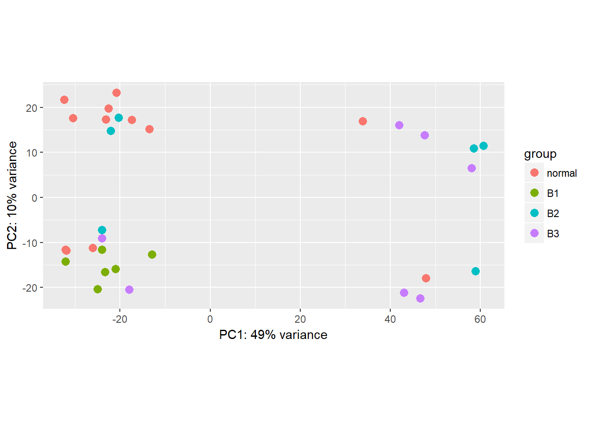

```r
plotPCA(vsd, "Sex_s")
```

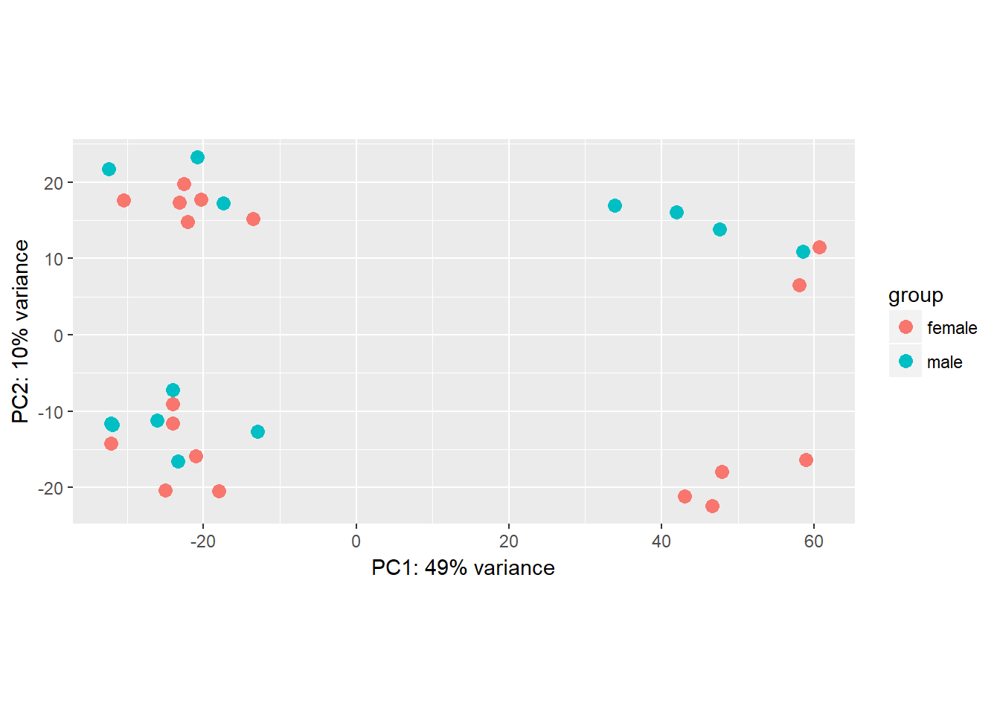

```r
plotPCA(vsd, "age_s")
```

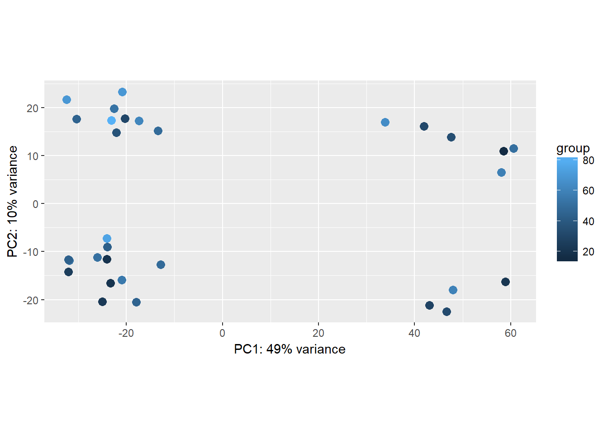

```r
plotPCA(vsd, "MBases_l")
```

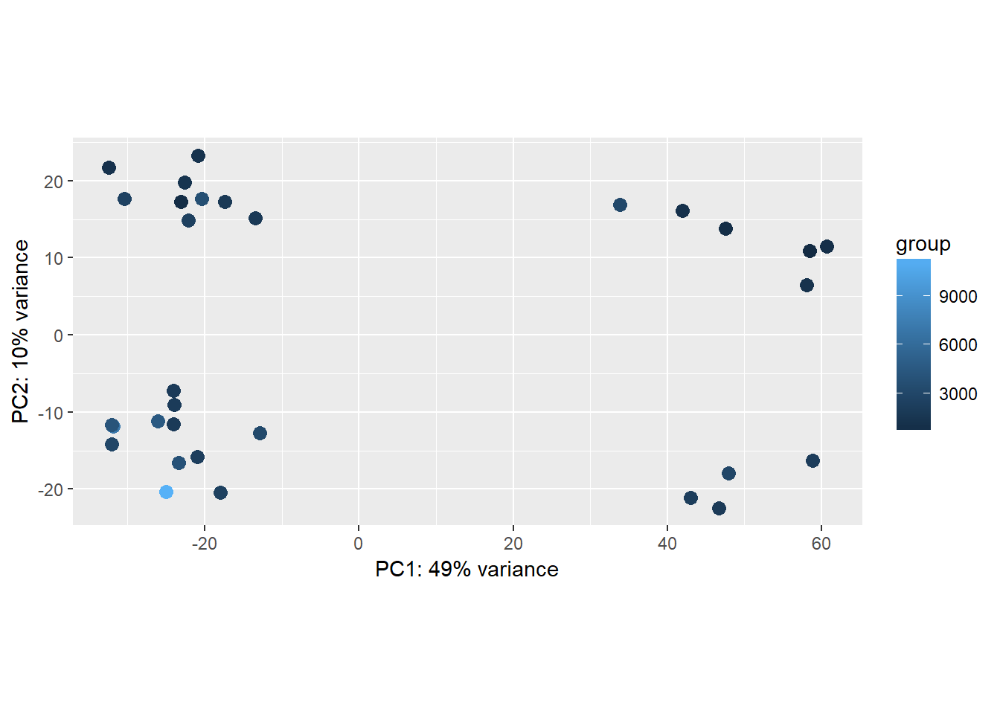


```r
# add new metadata
gsm <- read_delim(here("data","GSM_table.tsv"),delim="\t",col_names=c("GSM","title"))
```

```
## Parsed with column specification:
## cols(
##   GSM = col_character(),
##   title = col_character()
## )
```

```r
samp <- read_delim(here("data","sample_table.tsv"),delim="\t")
```

```
## Parsed with column specification:
## cols(
##   sample = col_integer(),
##   sex = col_character(),
##   tissue = col_character(),
##   subtype = col_character(),
##   status = col_character(),
##   montreal = col_character(),
##   platform = col_character(),
##   batch = col_character()
## )
```

```r
gsm$sample <- sub(".*\\[RNA-Seq, (.*?)_.*\\]","\\1",gsm$title)
samp$GSM <- gsm$GSM[match(samp$sample, gsm$sample)]
for (column in c("tissue", "montreal", "batch","sex")) {
  colData(dds)[[column]] <- samp[[column]][match(dds$Sample_Name_s, samp$GSM)]
}
dds$montreal <- factor(dds$montreal, lvls)
dds <- dds[,dds$tissue == "colon"]
table(dds$condition, dds$montreal)
```

```
##         
##          normal B1 B2 B3
##   normal     10  0  1  0
##   B1          0  6  0  0
##   B2          0  0  6  0
##   B3          0  1  0  6
```

```r
table(dds$Sex_s, dds$sex)
```

```
##         
##           F  M
##   female 17  1
##   male    0 12
```


```r
vsd <- vst(dds)
```

```
## using 'avgTxLength' from assays(dds), correcting for library size
```

```r
plotPCA(vsd) # old condition
```

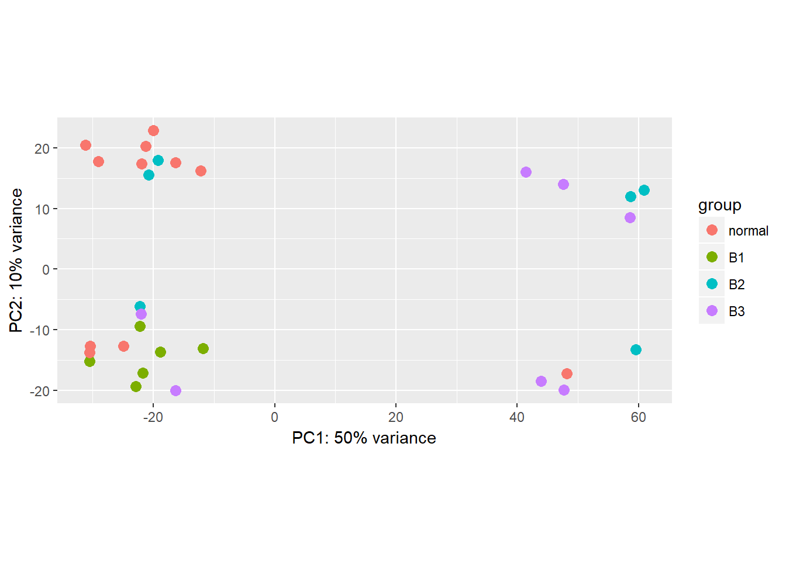

```r
plotPCA(vsd, "montreal")
```

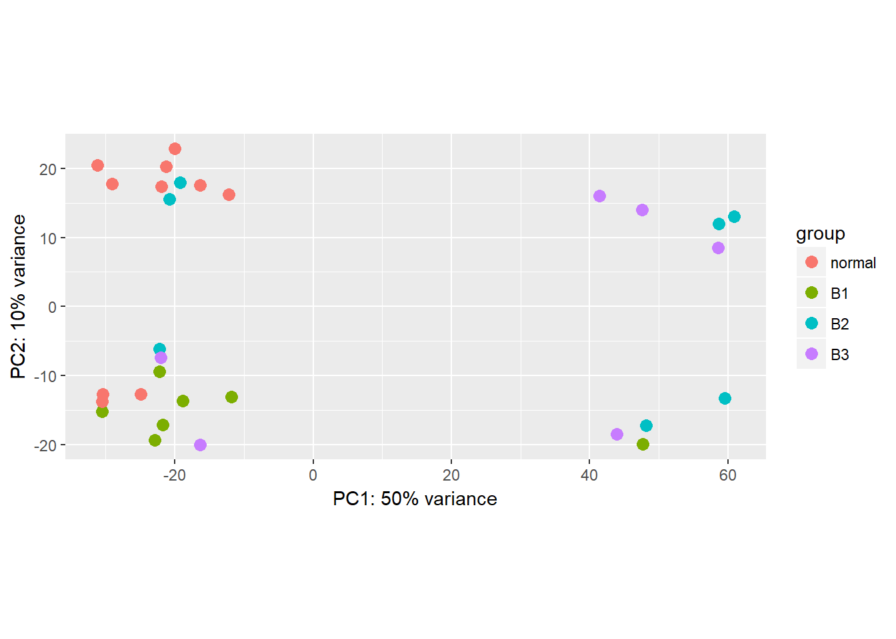

```r
plotPCA(vsd, "batch")
```

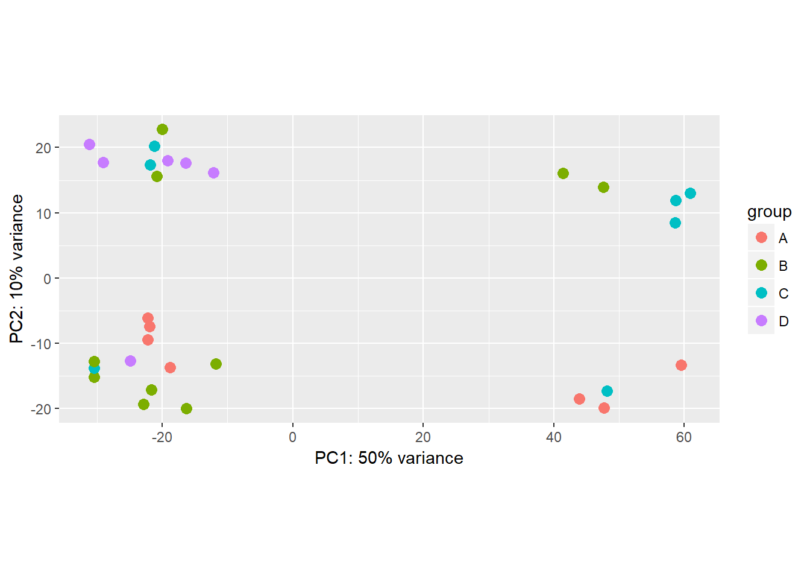

```r
plotPCA(vsd, "sex")
```

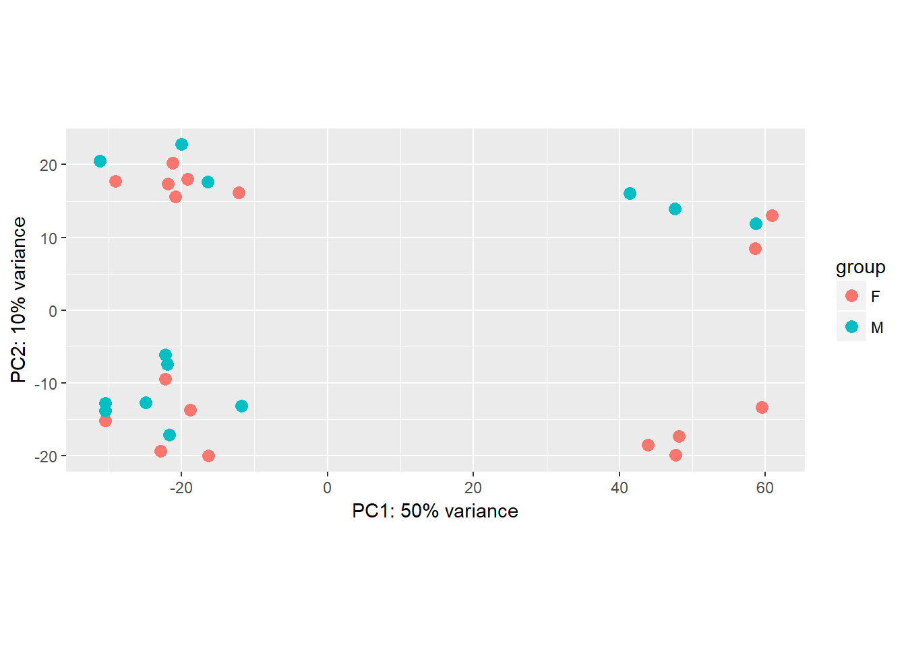


```r
design(dds) <- ~montreal
dds <- estimateSizeFactors(dds)
```

```
## using 'avgTxLength' from assays(dds), correcting for library size
```

```r
keep <- rowSums(counts(dds, normalized=TRUE) >= 10) >= 5
table(keep)
```

```
## keep
## FALSE  TRUE 
## 34080 24208
```

```r
dds <- dds[keep,]
```


```r
# takes <1 min
system.time({ dds <- DESeq(dds, test="LRT", reduced=~1, minReplicatesForReplace=Inf) })
```

```
## using pre-existing normalization factors
```

```
## estimating dispersions
```

```
## gene-wise dispersion estimates
```

```
## mean-dispersion relationship
```

```
## final dispersion estimates
```

```
## fitting model and testing
```

```
##    user  system elapsed 
##   35.78    0.29   36.12
```

```r
res <- results(dds, alpha=.05)
summary(res)
```

```
## 
## out of 24208 with nonzero total read count
## adjusted p-value < 0.05
## LFC > 0 (up)     : 753, 3.1% 
## LFC < 0 (down)   : 406, 1.7% 
## outliers [1]     : 29, 0.12% 
## low counts [2]   : 0, 0% 
## (mean count < 3)
## [1] see 'cooksCutoff' argument of ?results
## [2] see 'independentFiltering' argument of ?results
```


```r
resultsNames(dds)
```

```
## [1] "Intercept"             "montreal_B1_vs_normal" "montreal_B2_vs_normal"
## [4] "montreal_B3_vs_normal"
```

```r
system.time({
  # takes 30 s per call
  lfcB3 <- lfcShrink(dds, coef=4, type="normal")
})
```

```
##    user  system elapsed 
##   26.63    0.31   26.96
```

```r
lfcB2 <- lfcShrink(dds, coef=3, type="normal")
lfcB1 <- lfcShrink(dds, coef=2, type="normal")
```


```r
plotMA(lfcB3, xlim=c(1,1e6), ylim=c(-2,2), cex=1)
```

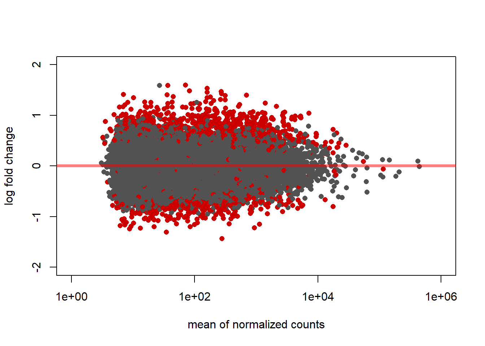


```r
plot(lfcB3$log2FoldChange, lfcB2$log2FoldChange)
abline(v=0, h=0, col="red")
```

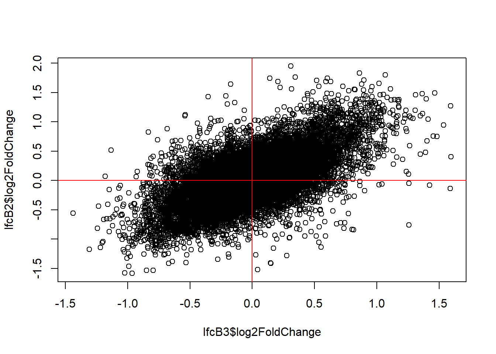

```r
plot(lfcB3$log2FoldChange, lfcB1$log2FoldChange)
abline(v=0, h=0, col="red")
```

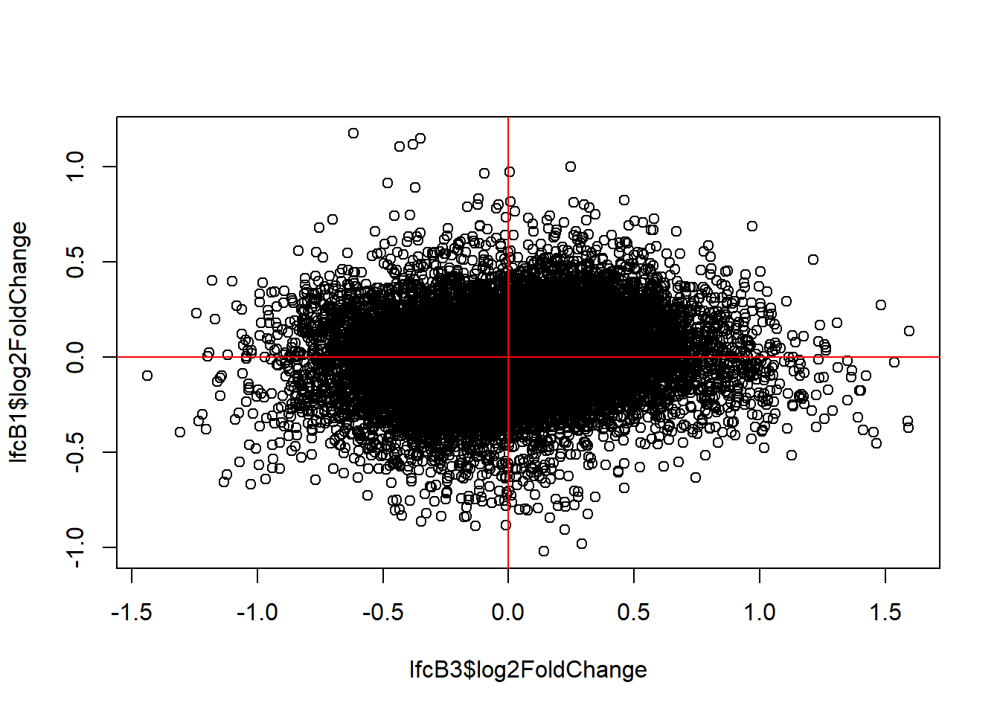


```r
par(mfrow=c(2,2), mar=c(3,4.5,3,1))
for (i in 1:4) 
  plotCounts(dds, gene=order(res$pvalue)[i], transform=FALSE, xlab="")
```

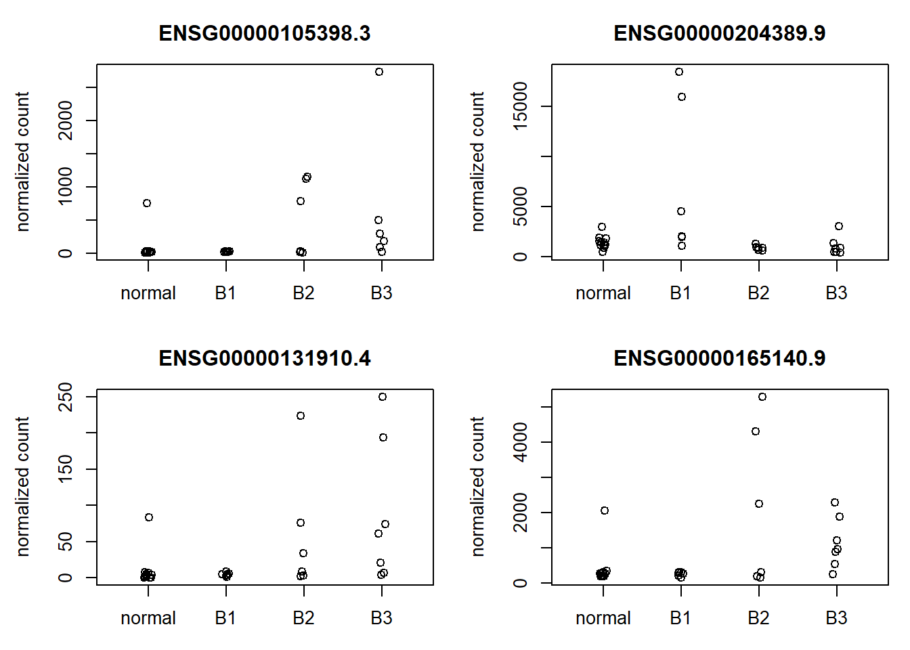

```r
par(mfrow=c(1,1))
```


```r
rownames(res)[order(res$pvalue)[1:4]]
```

```
## [1] "ENSG00000105398.3" "ENSG00000204389.9" "ENSG00000131910.4"
## [4] "ENSG00000165140.9"
```


```r
library(org.Hs.eg.db)
unname(
  mapIds(org.Hs.eg.db,
       sub("\\..*","",rownames(res)[order(res$pvalue)[1:50]]),
       "SYMBOL",
       "ENSEMBL")
)
```

```
## 'select()' returned 1:1 mapping between keys and columns
```

```
##  [1] "SULT2A1" "HSPA1A"  "NR0B2"   "FBP1"    "NPC1L1"  NA        "TREH"   
##  [8] "SEC14L2" "G6PC"    "PFKFB4"  "NAT8"    "HSPA1B"  "CXCL6"   "CUBN"   
## [15] "GRAMD1B" "ASAH2"   "CYP2C18" "SUSD2"   "ABCG5"   "FMO1"    "DNAJB13"
## [22] "SLC3A1"  NA        "MRO"     "MOCOS"   NA        "KIF5C"   "GCNT4"  
## [29] "KCNH6"   "LCT"     "SLC52A1" "HSPA2"   NA        "CDH7"    NA       
## [36] "PLEKHS1" "CDKL2"   "DHDH"    "MIR621"  "CYP4F3"  "SLC34A2" "DPEP1"  
## [43] "ACE2"    "ACE"     "ADGRG7"  "GDA"     NA        "CLDN15"  "SPOCK1" 
## [50] "NOL4"
```


```r
unname(
  mapIds(org.Hs.eg.db,
         sub("\\..*","",rownames(res)[order(res$pvalue)[1:50]]),
         "GENENAME",
         "ENSEMBL")
)
```

```
## 'select()' returned 1:1 mapping between keys and columns
```

```
##  [1] "sulfotransferase family 2A member 1"                          
##  [2] "heat shock protein family A (Hsp70) member 1A"                
##  [3] "nuclear receptor subfamily 0 group B member 2"                
##  [4] "fructose-bisphosphatase 1"                                    
##  [5] "NPC1 like intracellular cholesterol transporter 1"            
##  [6] NA                                                             
##  [7] "trehalase"                                                    
##  [8] "SEC14 like lipid binding 2"                                   
##  [9] "glucose-6-phosphatase catalytic subunit"                      
## [10] "6-phosphofructo-2-kinase/fructose-2,6-biphosphatase 4"        
## [11] "N-acetyltransferase 8 (putative)"                             
## [12] "heat shock protein family A (Hsp70) member 1B"                
## [13] "C-X-C motif chemokine ligand 6"                               
## [14] "cubilin"                                                      
## [15] "GRAM domain containing 1B"                                    
## [16] "N-acylsphingosine amidohydrolase 2"                           
## [17] "cytochrome P450 family 2 subfamily C member 18"               
## [18] "sushi domain containing 2"                                    
## [19] "ATP binding cassette subfamily G member 5"                    
## [20] "flavin containing monooxygenase 1"                            
## [21] "DnaJ heat shock protein family (Hsp40) member B13"            
## [22] "solute carrier family 3 member 1"                             
## [23] NA                                                             
## [24] "maestro"                                                      
## [25] "molybdenum cofactor sulfurase"                                
## [26] NA                                                             
## [27] "kinesin family member 5C"                                     
## [28] "glucosaminyl (N-acetyl) transferase 4, core 2"                
## [29] "potassium voltage-gated channel subfamily H member 6"         
## [30] "lactase"                                                      
## [31] "solute carrier family 52 member 1"                            
## [32] "heat shock protein family A (Hsp70) member 2"                 
## [33] NA                                                             
## [34] "cadherin 7"                                                   
## [35] NA                                                             
## [36] "pleckstrin homology domain containing S1"                     
## [37] "cyclin dependent kinase like 2"                               
## [38] "dihydrodiol dehydrogenase"                                    
## [39] "microRNA 621"                                                 
## [40] "cytochrome P450 family 4 subfamily F member 3"                
## [41] "solute carrier family 34 member 2"                            
## [42] "dipeptidase 1"                                                
## [43] "angiotensin I converting enzyme 2"                            
## [44] "angiotensin I converting enzyme"                              
## [45] "adhesion G protein-coupled receptor G7"                       
## [46] "guanine deaminase"                                            
## [47] NA                                                             
## [48] "claudin 15"                                                   
## [49] "SPARC/osteonectin, cwcv and kazal like domains proteoglycan 1"
## [50] "nucleolar protein 4"
```


```r
library(goseq)
padj <- ifelse(is.na(res$padj), 1, res$padj)
genes <- as.integer(padj < .05)
strp <- function(x) sub("(.*)\\..*","\\1",x)
names(genes) <- strp(rownames(res))
table(genes)
```

```
## genes
##     0     1 
## 23049  1159
```

```r
table(duplicated(names(genes)))
```

```
## 
## FALSE  TRUE 
## 24186    22
```

```r
table(genes[duplicated(names(genes))])
```

```
## 
##  0 
## 22
```

```r
genes <- genes[!duplicated(names(genes))]
supportedOrganisms()[supportedOrganisms()$Genome=="hg38",]
```

```
##    Genome Id Id Description Lengths in geneLeneDataBase
## 98   hg38                                         FALSE
##    GO Annotation Available
## 98                    TRUE
```


```r
# we need length
# easy way (tximport gives us gene lengths)
lengthData <- rowMeans(assays(dds)[["avgTxLength"]])
names(lengthData) <- strp(names(lengthData))
lengthData <- lengthData[names(genes)]
```


```r
# what if we didn't use tximport?
ebg <- exonsBy(gtf, by="gene")
rangePlotter <- function(x) {
  plot(c(start(x),end(x)),rep(seq_along(x),2),cex=.5,xlab="bp",ylab="")
  segments(start(x),seq_along(x),end(x),seq_along(x),lwd=3)
}
rangePlotter(ebg[[1]])
```

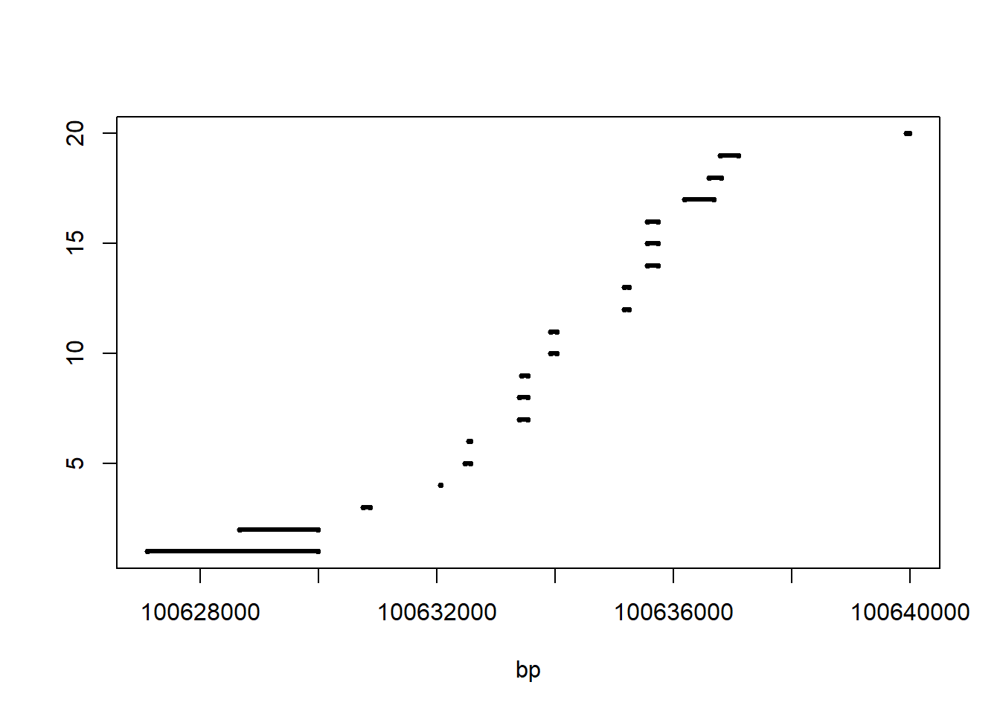

```r
ebg.red <- reduce(ebg)
rangePlotter(ebg.red[[1]])
```

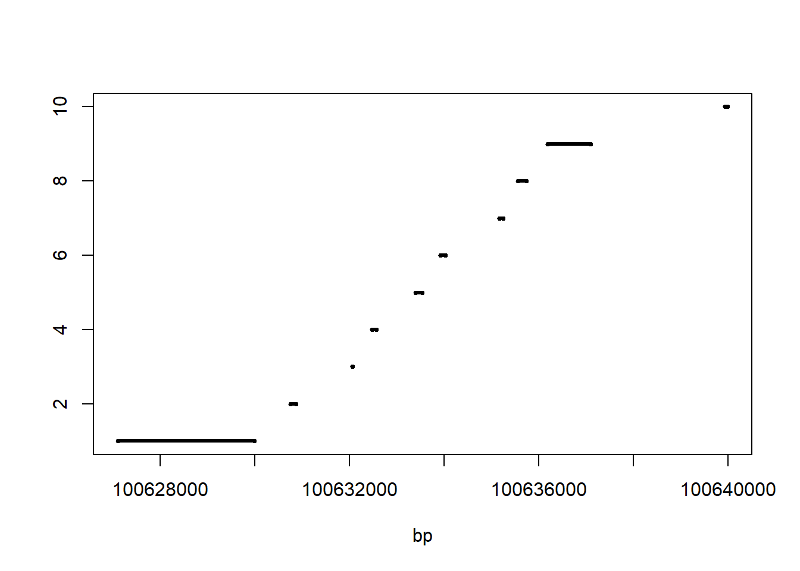

```r
lengthData2 <- sum(width(ebg))
names(lengthData2) <- strp(names(lengthData2))
lengthData2 <- lengthData2[names(genes)]
```


```r
# compare the two
plot(lengthData2, lengthData, log="xy", cex=.1,
     xlab="sum of all exons", ylab="length of expressed transcripts")
abline(0,1,col="red")
```

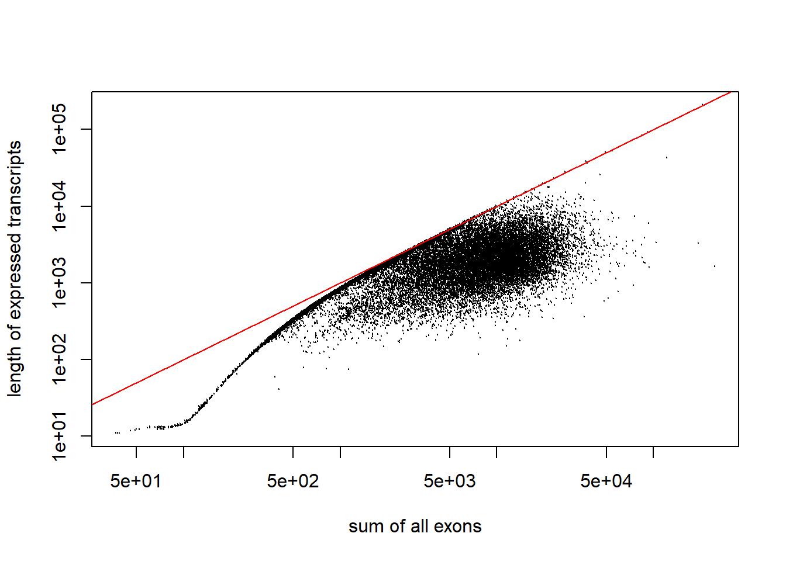


```r
pwf <- nullp(genes, genome="hg39", id="ensGene", bias.data=lengthData)
```

```
## Warning in pcls(G): initial point very close to some inequality constraints
```

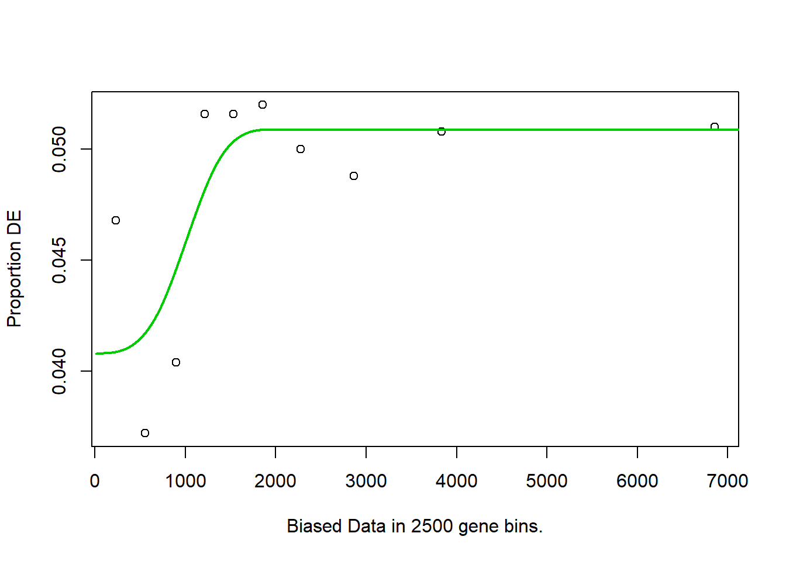

```r
go <- goseq(pwf, "hg38", "ensGene", test.cats="GO:BP")
```

```
## Fetching GO annotations...
```

```
## For 8562 genes, we could not find any categories. These genes will be excluded.
```

```
## To force their use, please run with use_genes_without_cat=TRUE (see documentation).
```

```
## This was the default behavior for version 1.15.1 and earlier.
```

```
## Calculating the p-values...
```

```
## 'select()' returned 1:1 mapping between keys and columns
```

```r
head(subset(go, numInCat < 200),20)
```

```
##         category over_represented_pvalue under_represented_pvalue
## 2118  GO:0007586            8.435311e-12                1.0000000
## 1736  GO:0006805            7.839669e-10                1.0000000
## 10803 GO:0071466            1.857505e-09                1.0000000
## 2458  GO:0009410            6.114013e-09                1.0000000
## 3472  GO:0017144            1.018321e-08                1.0000000
## 1625  GO:0006639            1.045722e-08                1.0000000
## 1624  GO:0006638            1.274076e-08                1.0000000
## 13618 GO:1903825            8.395064e-08                1.0000000
## 3748  GO:0019627            8.501698e-08                1.0000000
## 8582  GO:0050892            8.605781e-08                1.0000000
## 1626  GO:0006641            1.043382e-07                1.0000000
## 14183 GO:1905039            1.574349e-07                1.0000000
## 11029 GO:0071941            1.917445e-07                1.0000000
## 6626  GO:0042737            2.041501e-07                1.0000000
## 1687  GO:0006721            2.870248e-07                0.9999999
## 7083  GO:0044241            4.175004e-07                1.0000000
## 9262  GO:0055081            4.578777e-07                0.9999999
## 4223  GO:0030299            4.809182e-07                1.0000000
## 12117 GO:0098856            4.809182e-07                1.0000000
## 5774  GO:0035428            5.561852e-07                1.0000000
##       numDEInCat numInCat                                     term
## 2118          30      127                                digestion
## 1736          24      100             xenobiotic metabolic process
## 10803         24      104 cellular response to xenobiotic stimulus
## 2458          24      110          response to xenobiotic stimulus
## 3472          13       33                   drug metabolic process
## 1625          22       96           acylglycerol metabolic process
## 1624          22       97          neutral lipid metabolic process
## 13618         21       96     organic acid transmembrane transport
## 3748           8       13                   urea metabolic process
## 8582          12       32                    intestinal absorption
## 1626          19       83           triglyceride metabolic process
## 14183         20       91  carboxylic acid transmembrane transport
## 11029          8       14         nitrogen cycle metabolic process
## 6626           8       14                   drug catabolic process
## 1687          19       88              terpenoid metabolic process
## 7083           8       15                          lipid digestion
## 9262          12       37                        anion homeostasis
## 4223           7       11        intestinal cholesterol absorption
## 12117          7       11              intestinal lipid absorption
## 5774           9       20           hexose transmembrane transport
##       ontology
## 2118        BP
## 1736        BP
## 10803       BP
## 2458        BP
## 3472        BP
## 1625        BP
## 1624        BP
## 13618       BP
## 3748        BP
## 8582        BP
## 1626        BP
## 14183       BP
## 11029       BP
## 6626        BP
## 1687        BP
## 7083        BP
## 9262        BP
## 4223        BP
## 12117       BP
## 5774        BP
```
